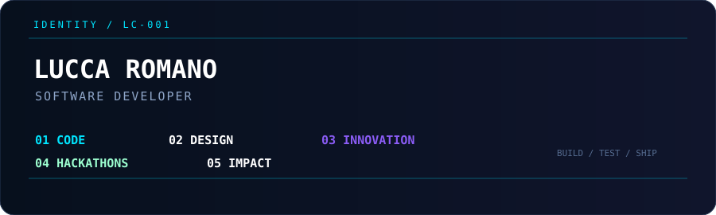
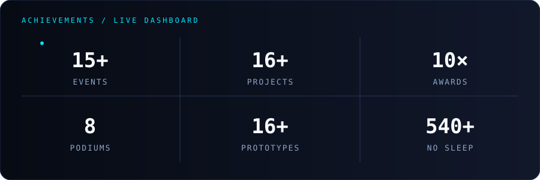
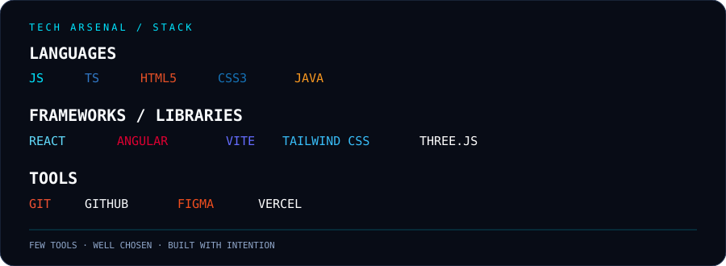
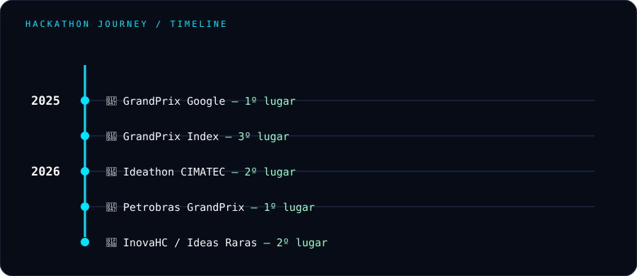
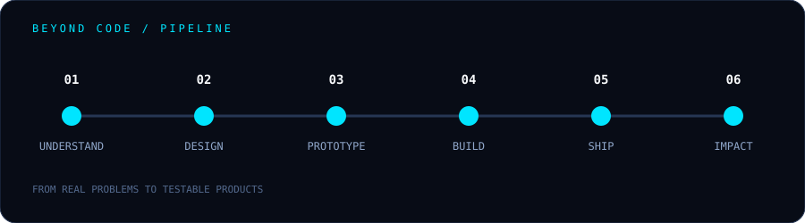
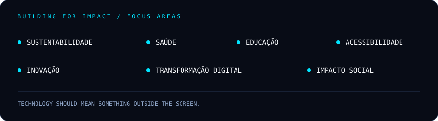

<p align="center">
  
</p>

<p align="center">
  <a href="#sobre-mim">Sobre mim</a> ·
  <a href="#tech-arsenal">Tech Arsenal</a> ·
  <a href="#hackathon-journey">Hackathon Journey</a> ·
  <a href="#projetos-que-estou-construindo">Projetos</a> ·
  <a href="#lets-connect">Contato</a>
</p>

> **Eu programo, mas meu objetivo é construir.**

## Sobre mim

Eu sou **Lucca Romano**, também conhecido como **Lc**. Sou estudante de **Desenvolvimento de Sistemas no SENAI CIMATEC** e de **Engenharia de Software na UCSAL**. Também atuo como **Junior Ambassador de Inovação no CIMATEC**.

Meu trabalho vive na interseção entre **desenvolvimento de software, design, inovação, prototipação, hackathons e impacto social**. Gosto de transformar problemas concretos em produtos digitais que possam ser testados, melhorados e colocados em movimento.

<p align="center">
  
</p>

| CODE | DESIGN | BUILD | IMPACT |
|:---:|:---:|:---:|:---:|
| Software com intenção | Experiências que fazem sentido | Protótipos que saem do papel | Soluções para problemas reais |

## Quick stats

<p align="center">
  
</p>

| 15+ | 16+ | 10× | 8 | 16+ | 540+ |
|:---:|:---:|:---:|:---:|:---:|:---:|
| Eventos | Projetos | Premiações | Pódios | Protótipos | Horas sem dormir |

---

## Tech Arsenal

<p align="center">
  
</p>

Minha stack é intencional: tecnologia suficiente para explorar ideias, prototipar rápido e construir produtos com clareza.

| Categoria | Tecnologias |
|---|---|
| Linguagens | `JavaScript` · `TypeScript` · `HTML` · `CSS` · `Java` |
| Frameworks e bibliotecas | `React` · `Angular` · `Vite` · `Tailwind CSS` · `Three.js` |
| Ferramentas | `Git` · `GitHub` · `Figma` · `Vercel` |

---

## Hackathon Journey

Não participo de hackathons apenas para competir. Eles são meu laboratório de pressão, colaboração e prototipação: um espaço para sair de uma pergunta e chegar a algo demonstrável em pouco tempo.

<p align="center">
  
</p>

| Ano | Evento | Resultado |
|:---:|---|:---:|
| 2025 | **GrandPrix Google** | **1º lugar** |
| 2025 | **GrandPrix Index** | **3º lugar** |
| 2026 | **Ideathon CIMATEC** | **2º lugar** |
| 2026 | **Petrobras GrandPrix** | **1º lugar** |
| 2026 | **InovaHC / Ideas Raras** | **2º lugar** |

*Também participei de outros hackathons e eventos de inovação; a tabela destaca apenas as conquistas informadas.*

---

## Projetos que estou construindo

Uma seleção do meu radar de criação, com informações oficiais, status e links disponíveis para os projetos destacados.

| Projeto | Descrição | Stack | Status | Acesso |
|---|---|---|---|---|
| **[Hypatia](https://plataforma-hypatia.vercel.app)** | Plataforma de mentoria em programação com IA, criada para personalizar a jornada de aprendizado, oferecer trilhas de estudo, projetos práticos, chat com IA e desafios/hackathons para desenvolvedores. | `React` · `TypeScript` · `Vite` · `Tailwind CSS` | MVP / Protótipo funcional | [Abrir projeto](https://plataforma-hypatia.vercel.app) |
| **[MandaChuva](https://manda-chuva-mobile.vercel.app)** | Assistente climático com IA voltado para agricultores, oferecendo informações sobre clima, riscos para a plantação, análise visual de plantas e recomendações práticas para o campo. | `React` · `TypeScript` · `Vite` · `Tailwind CSS` | MVP / Protótipo funcional | [Abrir projeto](https://manda-chuva-mobile.vercel.app) |
| **[AXIS](https://axis-flax-xi.vercel.app)** | Plataforma inteligente de gestão energética que utiliza IA, monitoramento de consumo, indicadores de carbono e simulações para ajudar empresas a reduzir custos, emissões e desperdícios de energia. | `React` · `TypeScript` · `Vite` · `Tailwind CSS` | MVP / Protótipo funcional | [Abrir projeto](https://axis-flax-xi.vercel.app) |
| **[Orienta](https://orienta-mobile.vercel.app)** | Plataforma de orientação criada para ajudar usuários a encontrar caminhos e oportunidades para seu desenvolvimento, oferecendo uma experiência digital de orientação e acompanhamento. | `React` · `TypeScript` · `Vite` · `Tailwind CSS` | MVP / Protótipo funcional | [Abrir projeto](https://orienta-mobile.vercel.app) |
| **[Tríade L.A.B](https://landing-page-triade.vercel.app)** | Hub e identidade digital da Tríade L.A.B, grupo voltado à inovação, tecnologia, hackathons e desenvolvimento de soluções para problemas reais. | `React` · `TypeScript` · `Vite` · `Tailwind CSS` | Landing Page / Projeto ativo | [Abrir projeto](https://landing-page-triade.vercel.app) |
| **[Ally](https://ally-site-rib3.vercel.app)** | Plataforma focada em tecnologia com empatia, buscando transformar desafios de acessibilidade e inclusão em experiências digitais mais humanas, simples e acessíveis. | `React` · `TypeScript` · `Vite` · `Tailwind CSS` | Site / Explicativo funcional | [Abrir projeto](https://ally-site-rib3.vercel.app) |

<details>
<summary><strong>Outros projetos no radar</strong></summary>

**EcoGestor** · **CtrlSec / AlôRaro** · **M.I.L.D** · **CapCure** · **Alforje** · **ManuAll 4.0**


Adicione descrições, tecnologias e links oficiais quando quiser expandir esta vitrine.

</details>

---

## Beyond Code

Meu diferencial não termina no editor. Eu conecto **desenvolvimento, design, inovação e experimentação** para construir algo que responda a uma necessidade real.

<p align="center">
  
</p>

| Etapa | Objetivo |
|:---:|---|
| 01 | Entender o problema |
| 02 | Desenhar possibilidades |
| 03 | Prototipar a ideia |
| 04 | Colocar para funcionar |

## Building for Impact

Muitos dos temas que me movem estão ligados a **saúde, sustentabilidade, educação, inovação, acessibilidade, transformação digital e impacto social**. Estou construindo essa história projeto a projeto — com curiosidade, rigor e vontade de fazer tecnologia significar alguma coisa fora da tela.

<p align="center">
  
</p>

---

## GitHub Analytics

O perfil do GitHub já apresenta diretamente a atividade e o gráfico de contribuições. Para acompanhar meu trabalho, acesse o [perfil oficial no GitHub](https://github.com/romanolc).

| Indicador | Perfil |
|---|---|
| Usuário | [`@romanolc`](https://github.com/romanolc) |
| Repositórios | [Ver repositórios](https://github.com/romanolc?tab=repositories) |
| Projetos públicos | [Ver projetos no perfil](https://github.com/romanolc?tab=projects) |
| Atividade | [Ver contribuições](https://github.com/romanolc) |

---

## Hackathon Mode

<p align="center">
  
</p>

<details>
<summary><strong>Terminal interno</strong></summary>

```text
$ whoami
lc — builder in progress

$ sudo make impact
[ok] problem detected
[ok] ideas connected
[ok] prototype shipped

$ sleep
permission denied: mission still running
```

</details>

---

## Let's Connect

Aqui estão meus principais canais para contato e acompanhamento do meu trabalho:

| Canal | Link |
|---|---|
| GitHub | [github.com/romanolc](https://github.com/romanolc) |
| LinkedIn | [linkedin.com/in/lucca-romano-686763357](https://www.linkedin.com/in/lucca-romano-686763357) |
| Instagram | [instagram.com/romano.lc](https://www.instagram.com/romano.lc/) |
| Portfólio | [portifolio-lucca-romano.vercel.app](https://portifolio-lucca-romano.vercel.app) |

<p align="center">
  <strong>Eu programo, mas meu objetivo é construir.</strong><br />
  <sub>Lucca Romano · building ideas into products</sub>
</p>

<!-- easter egg: if you found this, you are already looking beneath the interface. -->
<!-- TODO: replace the remaining placeholders, then ship. -->
